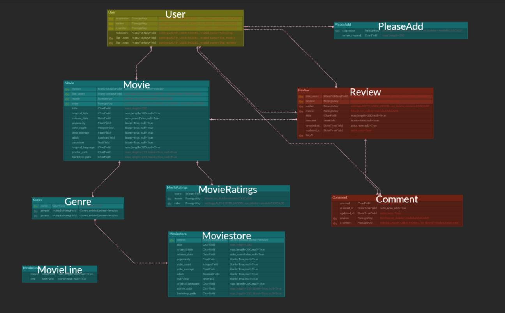

# Final PJT 

## 00 개요 및 파일구조

프로젝트 : 평점 정보를 기반으로 영화를 추천하는 웹 애플리케이션 제작

## 01 팀원 정보 및 업무 분담 내역

### 01.1 팀원 정보

팀장 : 서울 5반 이은재

팀원 : 서울 5반 임혜민

### 01.2 업무 분담 내역

#### 주 역할

이은재 : Back/ Algorithm

임혜민 : Front / Django

#### 관련 정보

- Django, vanilla JS를 활용한 '정보 기반 영화 추천 프로젝트'
- 작업 방식 : vs code live share, 웹엑스 회의, trello로 스케쥴 관리

#### 진행 방식

- 초반에 장고의 기본 accounts, movies 등 아주 기본적 CRUD기능 함께 구현
- API를 활용해 DB에 영화정보를 저장하는 과정까지 함께 진행
- 이후 추천 알고리즘 선택 과정에서 역할 분담
  - 임혜민 - 명세에 따라 장고 필수 기능 구현 / 유저 인터페이스 구성 / 추가 기능 구현
  - 이은재 - 협업필터링 알고리즘 학습 후 구현 / 부가 가능(페이지네이션 등) 구현

## 02 목표 서비스 구현 및 실제 구현 정도

### 02.1 목표 서비스

주어진 명세 : 정보 기반 영화 추천 프로젝트

- 팀 회의를 통해 프로젝트에서 각자 달성하고픈 목표 공유
  - 임혜민 : 반응형 웹디자인을 구현해 사용자 경험을 극대화 / 추가 기능 구현
    - 프런트에 집중 + 기타 다양한 추가 기능(명대사 추천/추천 tiers) 구현
  - 이은재 : 기존 프로젝트에서 더 나아가 알고리즘다운 알고리즘을 구현하고싶다.
    - 벡엔드에 집중, 협업 필터링을 실제 구현

### 02.2 실제 구현 정도

- 필수 구현은 모두 만족
- 기타 기능 구현

### 02.3 협업 필터링 알고리즘

#### 1. 협업필터링(collaborative filtering)란 ?

* 협업필터링이란 많은 사용자로부터 얻은 데이터를 바탕으로 사용자들의 관심사를 예측해주는 빙법입니다.  협업필터링의 기본가정은 사용자의 성향이 과거에서 미래까지 그대로 유지 될것이라는것입니다. 

#### 2. 사용자 기반 추천시스템

>  이번 프로젝트에서의 추천 알고리즘은 협업필터링을 활용한 사용자 기반 추천 시스템을 구현했습니다.

##### 구현과정

1. db에 있는 모든 평점 데이터(MovieRatings)에서 내가 평점 데이터, 나를 제외한 모든 사용자 평점 데이터로 나눔
2. 나와 다른 사용자의 데이터를 비교하면서 평점을 내린 영화가 일정갯수 이상 겹칠경우에만, 겹치는 영화들의 평점들의 유사도 측정 시작
3. 나와 모든 사용자의 유사도를 측정이 끝나면, 유사도가 높은 순서대로 사용자를 정렬
4. 나는 안봤지만, 사용자는 본 영화들을 (유사도 * 해당사용자가 평가내린 평점) 을 기준으로 정렬한뒤 점수가 높은 순서대로 나에게 추천해준다.

## 03 데이터베이스 모델링(ERD)

## 04 필수 기능

- 필수 기능
  - 관리자
    - O : 관리자만 영화 등록/수정/삭제 가능  
      - 유저는 관리자에게 영화 추가 요청보낼 수 있게 구현했음
    - O : 권리자 권한 유저만 유저관리 가능
      - admin에서 관리 가능
  - 영화 정보
    - O : 50개 이상의 데이터 존재
      - 협업 필터링 정확도를 위해 영화 1000편
      - 향후 DB추가를 위해 백업 DB에 2000편 저장
    - O : 로그인된 유저는 평점 등록, 수정, 삭제 가능해야
      -  form을 통해 가능하도록 구현
  - 추천 알고리즘
    - O : 평점 등록 후 그 기반으로 추천받을 수 있도록
      - 협업 필터링 알고리즘 작동 방식 자체가 타 유저의 평점내역과 사용자의 평점 내역을 비교해 가장 유사한 이용자들의 평점 정보를 활용, 적절한 영화를 추천해줌
    - O: 1개 이상의 방식으로 추천
      - 모든 사용자에게 동일한 추천 : 실시간 추천/ 평점순 추천/ 장르별 추천
      - 사용자 마다 다른 추천(비회원 포함) : 랜덤 영화 추천 / 괜찮은 영화 추천
      - 사용자마다 다른 추천(회원 서비스) : 프리미엄 추천
    - O : 추천 시스템 구성을 설명할 수 있어야
      - 일반 추천 / 랜덤 추천 / 괜찮은 영화 추천 / 프리미엄 추천
  - 커뮤니티
    - O : 영화 정보 관련 대화가 가능한 커뮤니티 있어야 함
      - 리뷰앱에서 가능
    - O : 로그인한 사용자만 조회/생성 가능
      - 아니면 리다이렉트 시켜줌
    - O : 본인만 본인 글 수정, 삭제
      - 아니면 리다이렉트
    - O : 사용자는 댓글 작성 가능해야
      - 예쁘게 잘달림
    - O : 본인만 자기 댓글 삭제 가능
      - 리다이렉트 됨
    - O : 각 게시글 및 댓글은 생성 및 수정 시각 정보 포함되어야
      - 모두 포함
  - O : 최소 5개 이상의 URL 및 페이지 구성
    - 엄청 많음

- 기타 기능
  - 추가 기능
    - 프로필 + 회사 정보 페이지 : 보다 그럴듯한 구성을 위해 회사 정보 표기
    - 유저들을 위한 명대사 추천 기능
  - 추가 활용
    - pagination : 리뷰 모아보기 페이지
    - 메시지 프레임워크 : 추천 알고리즘 작동 시 오류일 때
    - ajax통한 비동기 요청 : 좋아요, 팔로우 기능

